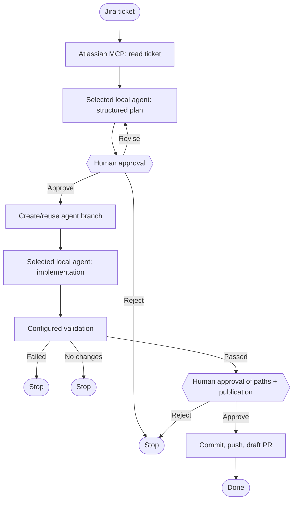
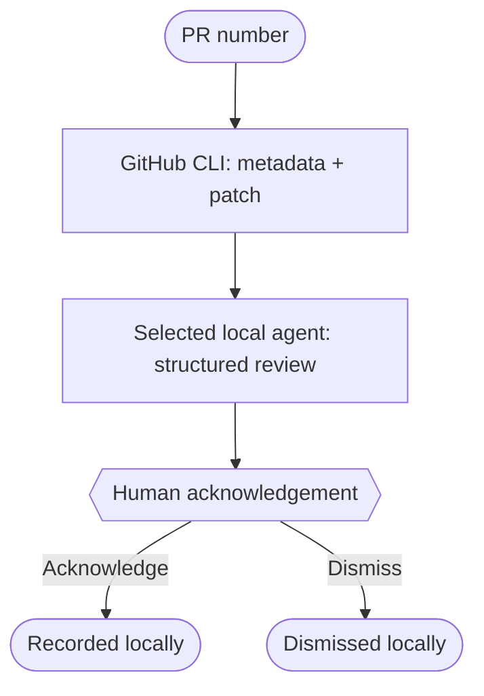

# Agentic SDLC Workflows

Local, human-approved workflows for taking a Jira ticket from plan to a draft
pull request, or reviewing an existing GitHub pull request without posting
comments. The project uses an authenticated local coding-agent CLI, keeps
secrets out of graph state, and deliberately pauses before every material
action.

> Status: a local-first foundation for continued work toward a fully
> plug-and-play SDLC workflow tool. The default validation profile is Flutter;
> other repositories can supply their own validation commands.

## What it does

| Flow | Input | What it can do | What it will not do automatically |
| --- | --- | --- | --- |
| Jira delivery | Jira key such as `PROJ-14` | Fetch ticket, draft a plan, implement after approval, validate, then create a draft PR after a second approval | Push, commit, or create a PR without explicit approval |
| Pull-request review | GitHub PR number | Read the PR and patch, generate a structured local review, display it in the local UI | Change code, post comments, or alter GitHub |

## Flow diagrams

### Jira delivery



The editable source is [docs/graphs/jira_delivery.mmd](docs/graphs/jira_delivery.mmd).

### Pull-request review



The editable source is [docs/graphs/pr_review.mmd](docs/graphs/pr_review.mmd).

## How LangGraph is used

LangGraph is the workflow runtime, not an external service that must be
installed separately on the machine. It defines the resumable graph nodes,
human-approval interrupts, and state transitions for both flows. SQLite
checkpoints preserve a paused run so it can be resumed after a plan or
publication decision.

Installing this project's Python dependencies installs the LangGraph runtime:

```bash
.venv/bin/pip install -e '.[dev]'
```

That command installs:

- `langgraph` and `langgraph-checkpoint-sqlite` for the local CLI and browser
  UI; and
- the `langgraph-cli`, `langgraph-api`, and `langgraph-runtime-inmem` development
  extras needed only when using `langgraph dev` / LangGraph Studio.

Use the standard install when you need the local UI or terminal workflow. Use
the `dev` extra shown above when you also want Studio and the test tooling.

## Prerequisites

Install these on the machine that runs the workflow:

1. Python 3.11 or later.
2. Git and a target repository with an `origin` remote.
3. One authenticated local agent provider:
   - [Codex CLI](https://developers.openai.com/) (the default), or
   - [GitHub Copilot CLI](https://docs.github.com/en/copilot/get-started/cli-quickstart)
     installed and authenticated with `copilot login`.
4. For **Jira delivery**: an Atlassian MCP connection enabled and authorized
   in the selected provider, with permission to read the target Jira issue.
   No Jira API token is required by this project. Copilot uses the MCP server
   name in `WORKFLOW_COPILOT_TICKET_MCP_SERVER` (default: `atlassian`).
5. For **pull-request review** and **draft-PR publication**: GitHub CLI
   (`gh`) authenticated for the target repository. The review flow is
   read-only; Jira delivery needs GitHub write permission only after you
   approve publication.
6. The target repository's validator. Flutter projects need `flutter` on
   `PATH`; other projects should set `WORKFLOW_VALIDATION_COMMANDS`.

MCP integrations are tools that extend model runs; the workflow restricts its
Jira retrieval prompt to the configured Atlassian MCP connection. See the
[official OpenAI MCP tools reference](https://developers.openai.com/api/reference/cli/resources/responses/methods/create)
for the underlying tool model.

## Install

```bash
git clone <your-repository-url> agentic-sdlc-workflows
cd agentic-sdlc-workflows
python3 -m venv .venv
.venv/bin/pip install -e '.[dev]'
```

Confirm the local integrations before the first real run:

```bash
codex --version
copilot --version # only when using GitHub Copilot CLI
gh auth status
```

If needed, create local-only overrides:

```bash
cp .env.example .env
```

Agent configuration, Atlassian credentials, and GitHub credentials stay
outside this repository. Do not commit `.env`.

## Choose an agent provider

The browser UI exposes an **Agent provider** selector for every run. Codex
remains the default. For command-line and Studio runs, set the provider in
local-only `.env`:

```dotenv
# codex (default) or copilot
WORKFLOW_AGENT_PROVIDER=copilot

# Optional GitHub Copilot model override. Omit to use its local/CLI default.
WORKFLOW_COPILOT_MODEL=gpt-5.3-codex

# Name of the Atlassian MCP server configured for Copilot CLI.
WORKFLOW_COPILOT_TICKET_MCP_SERVER=atlassian
```

Copilot's programmatic CLI supports an explicit model override. Its reasoning
effort is intentionally read from its own local `settings.json` rather than
mutated by this project; some Copilot models do not expose the same effort
levels. Codex model and reasoning-effort overrides continue to work as before.

Both providers receive Jira and PR content for the selected flow. The same
human approvals, file-change review, no-push implementation rule, and draft-PR
publication gate apply regardless of provider.

## How adapters work

The graph is intentionally separated from external systems. Its adapters turn
workflow actions into local CLI calls, so the graph remains testable with fake
ticket, agent, Git, and validator implementations.

| Adapter responsibility | Default implementation | Behaviour |
| --- | --- | --- |
| Jira ticket retrieval | `LocalMcpTicketClient` | Uses the selected provider's Atlassian MCP connection and returns structured ticket fields. |
| Planning | `LocalPlanner` | Runs the selected CLI in read-only structured-output mode. |
| PR metadata and patch | `GitHubCliPullRequestClient` | Uses authenticated `gh` commands only; it never posts a review. |
| PR review | `LocalPullRequestReviewer` | Sends the fetched PR metadata and patch to the selected provider, returning structured findings locally. |
| Implementation | `CommandImplementer` / `CopilotImplementer` | Selects Codex or Copilot by default after plan approval; a custom `IMPLEMENTATION_COMMAND` can replace it. |
| Validation and publication | `ProjectValidator` / `GitOperations` | Runs the target repository's configured commands, then commits/pushes only after explicit path-level approval. |

Provider selection is scoped to one run through an in-memory configuration
context. It does not rewrite global Codex or Copilot settings. Codex receives
its selected model/effort flags; Copilot receives an optional model flag and
reads its effort from its own local settings. The Copilot adapter permits its
configured Atlassian MCP server only for Jira retrieval, and uses only `write`
and `shell` permissions for the approved implementation step. Credentials are
not stored in LangGraph state or returned to the browser.

## Configure a target repository

The target repository is always explicit. Pass it to the local UI or CLI:

```bash
TARGET_REPO=/absolute/path/to/your-repository
```

For a non-Flutter project, add validation commands to `.env` using a
semicolon-separated list:

```dotenv
WORKFLOW_VALIDATION_COMMANDS=npm test; npm run lint
```

The default remains:

```text
flutter analyze; flutter test
```

## Run the local UI

```bash
.venv/bin/python -m agentic_workflow.local_ui --repo "$TARGET_REPO"
```

Open `http://127.0.0.1:8080`. The UI is loopback-only. It lets you select the
flow, choose Codex CLI or GitHub Copilot CLI, optionally override the model,
and inspect the resolved local defaults before starting.

The Jira delivery flow pauses for plan approval and for the selected paths to
be committed/pushed. The pull-request review flow never writes to GitHub.

## Run from the terminal

Start a Jira delivery run:

```bash
.venv/bin/agentic-workflows --repo "$TARGET_REPO" start PROJ-14 --run-id proj-14-001
```

Resume after inspecting the plan:

```bash
.venv/bin/agentic-workflows --repo "$TARGET_REPO" resume \
  --run-id proj-14-001 \
  --decision '{"action":"approve"}'
```

At the publication gate, explicitly approve only the intended changed files:

```bash
.venv/bin/agentic-workflows --repo "$TARGET_REPO" resume \
  --run-id proj-14-001 \
  --decision '{"action":"approve","paths":["src/app.ts","test/app_test.ts"]}'
```

Run a local pull-request review:

```bash
.venv/bin/agentic-workflows --repo "$TARGET_REPO" review-pr 42 --run-id pr-42-001
```

## LangGraph Studio

Set the target and start the local Agent Server:

```bash
WORKFLOW_REPO="$TARGET_REPO" .venv/bin/langgraph dev
```

Studio exposes two graphs:

- `jira_delivery`
- `pr_review`

Use a unique thread ID per run. Studio's development server uses its own local
storage; the terminal CLI and browser UI use SQLite checkpoints in the target
repository under `.agentic-workflow/`.

## Safety model

- The workflow snapshots any pre-existing dirty working-tree state and only
  offers changes made during its own run for publication.
- `.env`, `.git`, `.agents`, and `.claude` paths are protected from final
  publication.
- Implementation is asked not to commit or push. Git publication occurs only
  after a human approves an explicit file list.
- PR review is local-only and never posts review comments.
- Token metrics in the UI are payload-size estimates, not billed usage.

## Future enhancements: plug-and-play roadmap

This foundation is intentionally local-first. The following work would make it
easier to install, operate, and extend across repositories without weakening
the approval model.

- **Provider plug-ins:** normalize capabilities, model discovery, effort
  controls, and usage telemetry across Codex, GitHub Copilot CLI, and future
  provider adapters. Surface only models actually available to the signed-in
  user and keep provider-specific limits clear in the UI.
- **Guided setup and diagnostics:** a first-run installer that verifies Python,
  Git, `gh`, chosen agent CLI authentication, MCP connectivity, repo access,
  and target-project validation commands with precise recovery steps.
- **Integration packs:** declarative Jira/Atlassian, GitHub, GitLab, Linear,
  and test/CI connectors with explicit read/write scopes and connection health
  checks. No integration should silently export repository or ticket content.
- **Repository profiles:** selectable validation presets for Flutter, Node,
  Python, iOS/Android, and custom projects, with project-local overrides and
  a dry-run validator.
- **Workflow catalog:** a UI-driven flow picker with Jira delivery, PR review,
  bug triage, release readiness, dependency/security review, and reusable
  organization templates. Each flow should include its graph, inputs, and
  publication permissions before it runs.
- **Richer review UX:** GitHub-style green/red diffs, line-level findings,
  test-result summaries, clear stage-specific errors, retry/resume controls,
  and a durable run history.
- **Transparent cost and execution visibility:** provider-reported usage where
  available, separated from payload estimates; live events, elapsed time,
  model/effort provenance, and privacy-safe local audit logs.
- **Stronger isolation:** optional worktrees or sandboxes per delivery run,
  protected-file policies, change budgets, safe cleanup, and an explicit
  handoff/recovery path for interrupted runs.
- **Distribution:** versioned configuration schema, a portable installer,
  example repositories, a compatibility matrix, CI smoke tests, and release
  notes so the tool can be adopted without copying project internals.

## Test

```bash
.venv/bin/python -m pytest
.venv/bin/python -m compileall -q agentic_workflow
```

## Project layout

```text
agentic_workflow/       Runtime, graphs, adapters, UI, and CLI
workflow_tests/         Unit tests for flow behavior and UI runtime
docs/graphs/            Mermaid sources for both workflows
langgraph.json          LangGraph Studio graph registry
.env.example            Local-only configuration template
```
