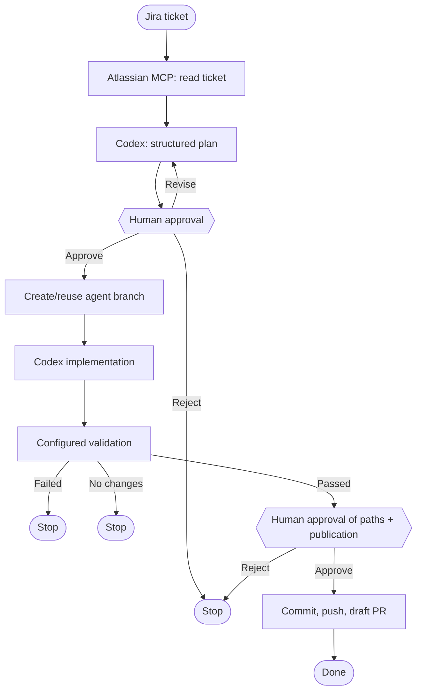
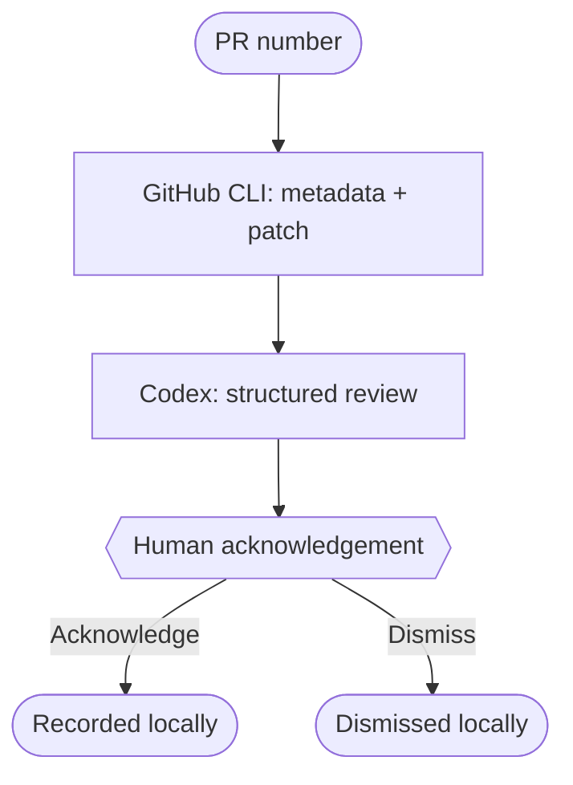

# Agentic SDLC Workflows

Local, human-approved workflows for taking a Jira ticket from plan to a draft
pull request, or reviewing an existing GitHub pull request without posting
comments. The project uses your authenticated local Codex CLI, keeps secrets
out of graph state, and deliberately pauses before every material action.

> Status: a local-first foundation for continued work toward a fully
> plug-and-play SDLC workflow tool. The default validation profile is Flutter;
> other repositories can supply their own validation commands.

## What it does

| Flow | Input | What it can do | What it will not do automatically |
| --- | --- | --- | --- |
| Jira delivery | Jira key such as `PROJ-14` | Fetch ticket, draft a plan, implement after approval, validate, then create a draft PR after a second approval | Push, commit, or create a PR without explicit approval |
| Pull-request review | GitHub PR number | Read the PR and patch, generate a structured local review, display it in the local UI | Change code, post comments, or alter GitHub |

## Flow diagrams

### Jira delivery



The editable source is [docs/graphs/jira_delivery.mmd](docs/graphs/jira_delivery.mmd).

### Pull-request review



The editable source is [docs/graphs/pr_review.mmd](docs/graphs/pr_review.mmd).

## Prerequisites

Install these on the machine that runs the workflow:

1. Python 3.11 or later.
2. Git and a target repository with an `origin` remote.
3. [Codex CLI](https://developers.openai.com/) authenticated locally. The
   workflow executes Codex locally and can use MCP tools available to that
   session.
4. For **Jira delivery**: the Atlassian MCP connection enabled and authorized
   in Codex, with permission to read the target Jira issue. No Jira API token
   is required by this project.
5. For **pull-request review** and **draft-PR publication**: GitHub CLI
   (`gh`) authenticated for the target repository. The review flow is
   read-only; Jira delivery needs GitHub write permission only after you
   approve publication.
6. The target repository's validator. Flutter projects need `flutter` on
   `PATH`; other projects should set `WORKFLOW_VALIDATION_COMMANDS`.

MCP integrations are tools that extend model runs; the workflow restricts its
Jira retrieval prompt to the configured Atlassian MCP connection. See the
[official OpenAI MCP tools reference](https://developers.openai.com/api/reference/cli/resources/responses/methods/create)
for the underlying tool model.

## Install

```bash
git clone <your-repository-url> agentic-sdlc-workflows
cd agentic-sdlc-workflows
python3 -m venv .venv
.venv/bin/pip install -e '.[dev]'
```

Confirm the local integrations before the first real run:

```bash
codex --version
gh auth status
```

If needed, create local-only overrides:

```bash
cp .env.example .env
```

`Codex` configuration, Atlassian credentials, and GitHub credentials stay
outside this repository. Do not commit `.env`.

## Configure a target repository

The target repository is always explicit. Pass it to the local UI or CLI:

```bash
TARGET_REPO=/absolute/path/to/your-repository
```

For a non-Flutter project, add validation commands to `.env` using a
semicolon-separated list:

```dotenv
WORKFLOW_VALIDATION_COMMANDS=npm test; npm run lint
```

The default remains:

```text
flutter analyze; flutter test
```

## Run the local UI

```bash
.venv/bin/python -m agentic_workflow.local_ui --repo "$TARGET_REPO"
```

Open `http://127.0.0.1:8080`. The UI is loopback-only. It lets you select the
flow, choose an optional Codex model and reasoning effort, and inspect the
resolved local defaults before starting.

The Jira delivery flow pauses for plan approval and for the selected paths to
be committed/pushed. The pull-request review flow never writes to GitHub.

## Run from the terminal

Start a Jira delivery run:

```bash
.venv/bin/agentic-workflows --repo "$TARGET_REPO" start PROJ-14 --run-id proj-14-001
```

Resume after inspecting the plan:

```bash
.venv/bin/agentic-workflows --repo "$TARGET_REPO" resume \
  --run-id proj-14-001 \
  --decision '{"action":"approve"}'
```

At the publication gate, explicitly approve only the intended changed files:

```bash
.venv/bin/agentic-workflows --repo "$TARGET_REPO" resume \
  --run-id proj-14-001 \
  --decision '{"action":"approve","paths":["src/app.ts","test/app_test.ts"]}'
```

Run a local pull-request review:

```bash
.venv/bin/agentic-workflows --repo "$TARGET_REPO" review-pr 42 --run-id pr-42-001
```

## LangGraph Studio

Set the target and start the local Agent Server:

```bash
WORKFLOW_REPO="$TARGET_REPO" .venv/bin/langgraph dev
```

Studio exposes two graphs:

- `jira_delivery`
- `pr_review`

Use a unique thread ID per run. Studio's development server uses its own local
storage; the terminal CLI and browser UI use SQLite checkpoints in the target
repository under `.agentic-workflow/`.

## Safety model

- The workflow snapshots any pre-existing dirty working-tree state and only
  offers changes made during its own run for publication.
- `.env`, `.git`, `.agents`, and `.claude` paths are protected from final
  publication.
- Implementation is asked not to commit or push. Git publication occurs only
  after a human approves an explicit file list.
- PR review is local-only and never posts review comments.
- Token metrics in the UI are payload-size estimates, not billed usage.

## Test

```bash
.venv/bin/python -m pytest
.venv/bin/python -m compileall -q agentic_workflow
```

## Project layout

```text
agentic_workflow/       Runtime, graphs, adapters, UI, and CLI
workflow_tests/         Unit tests for flow behavior and UI runtime
docs/graphs/            Mermaid sources for both workflows
langgraph.json          LangGraph Studio graph registry
.env.example            Local-only configuration template
```
