# Choosing Between an Agent Skill and an Agentic SDLC Workflow

## A practical guide for mobile engineering teams

Mobile teams already rely on playbooks and delivery pipelines. A pull-request checklist helps an engineer review code consistently; a CI pipeline makes sure required checks actually run. Agent skills and agentic workflows have roughly the same relationship.

An **agent skill** is a reusable engineering playbook. It gives an agent the team's instructions, conventions, examples, and tools for a particular kind of work.

An **agentic SDLC workflow** is an executable delivery process. It coordinates agents and engineering systems, records state, and controls when the work can move to the next stage.

The two overlap. Either one can help review a pull request, groom a ticket, investigate a crash, or prepare a release. The practical difference is **who controls the next step and which rules are guaranteed**.

> A skill helps the agent make good engineering decisions. A workflow makes sure the delivery process follows its required path.

This is not a choice between a “basic” and an “advanced” solution. A well-written skill may be the better tool for an open-ended investigation. A workflow is the better tool when the team needs durable state, enforced approvals, repeatability, or an audit trail. Many production use cases need both.

## A simple mental model

Think about an experienced iOS engineer working with a release checklist:

- A **skill** is similar to giving the engineer a playbook: how the team structures Swift code, what to inspect in a pull request, which tests to run, and when to escalate.
- A **workflow** is similar to putting that playbook into a release system that records progress, blocks prohibited actions, waits for approvals, runs required checks, and resumes where it stopped.

The engineer may complete the same work in either case. What changes is how much the process depends on individual judgment and how much is enforced by the surrounding system.

```text
Skill-driven work

Developer request
    -> agent applies the team's playbook
    -> agent chooses and performs the steps
    -> developer reviews the result


Workflow-driven work

Developer or system trigger
    -> workflow selects the next allowed stage
    -> agent handles the work that requires judgment
    -> workflow records and validates the result
    -> approval or policy determines whether it continues
```

## What is an agent skill?

A skill packages reusable knowledge for an agent. It commonly contains:

- Task instructions and recommended steps
- Team architecture and coding conventions
- Examples of good output
- Review checklists
- References and templates
- Commands or helper scripts
- Rules describing when the agent should stop or ask for help

For an iOS team, a skill might teach an agent to:

- Review Swift concurrency code for actor-isolation and cancellation issues
- Apply the team's SwiftUI state-management conventions
- Write XCTest or Swift Testing coverage for a bug fix
- Prepare a structured root-cause analysis
- Groom a Jira ticket using a standard Definition of Ready

The agent reads the skill and reasons about how to apply it to the current task. The skill improves consistency and domain awareness, but the agent remains the main process controller.

### What a skill is good at

- Capturing engineering knowledge that would otherwise live in a wiki or in senior engineers' heads
- Adapting guidance to different features and repositories
- Handling ambiguous or unfamiliar situations conversationally
- Giving developers a lightweight, interactive assistant
- Evolving quickly as team practices change
- Reusing the same guidance across many tasks

### What a skill does not provide by itself

A skill does not inherently provide:

- Durable execution state
- A database of workflow runs
- Guaranteed stage ordering
- Enforced approval gates
- Scheduling or event triggers
- Reliable retry and timeout behavior
- Cross-run reporting and audit history
- Guaranteed prevention of a commit, merge, deployment, or external update

A skill can call scripts that provide some of these capabilities. When those scripts begin managing state, transitions, approvals, and retries, they are effectively becoming a workflow engine behind the skill.

## What is an agentic SDLC workflow?

An agentic SDLC workflow is an application or automation that owns the lifecycle of the task. It uses agents for the parts that require interpretation, reasoning, or code generation, while deterministic code controls the process around them.

A workflow normally defines:

- Inputs and structured outputs
- Allowed stages and transitions
- Persistent state and resumability
- Agent and tool permissions
- Approval boundaries
- Validation requirements
- Retryable and terminal failures
- Audit events and status reporting
- Publication or deployment rules

For example, a Jira-to-draft-PR workflow might require this sequence:

```text
Fetch Jira ticket
    -> verify that the integration succeeded
    -> analyze repository context
    -> produce an implementation plan
    -> wait for plan approval
    -> create a branch
    -> implement within approved scope
    -> run build, tests, lint, and static analysis
    -> wait for publication approval
    -> commit, push, and create a draft pull request
```

The agent can decide how to understand the ticket or implement the change. It cannot decide to bypass an approval stage if the workflow makes that transition impossible.

### What a workflow is good at

- Enforcing a repeatable engineering process
- Coordinating several systems, such as Jira, source control, CI, and release services
- Pausing and resuming long-running work
- Supporting formal approval and compliance requirements
- Normalizing errors from multiple tools or agent providers
- Recording what happened and why
- Safely increasing the level of automation over time

### What a workflow costs

- More software to design, test, deploy, and maintain
- Integration code that can break when external APIs or command-line tools change
- More up-front decisions about states and failure paths
- Less freedom when a task does not fit the predefined route
- Operational ownership for credentials, logs, storage, and upgrades
- A risk of rebuilding features already provided by CI/CD or engineering platforms

## The actual differences

| Dimension | Agent skill | Agentic SDLC workflow |
| --- | --- | --- |
| Primary role | Teach the agent how to do a task | Control how a task moves through the SDLC |
| Process controller | The agent interprets instructions and chooses the next action | Application code or a workflow engine selects the next allowed stage |
| Best input | An interactive developer request | A structured request, event, schedule, or API call |
| Adaptability | High; the agent can adjust the approach | Bounded by implemented states and transitions |
| Repeatability | Good guidance, but results may vary | High for process order and policy enforcement |
| State | Usually conversation, task context, or files | Explicit state stored for the run |
| Resume after interruption | Depends on the agent environment and available context | Designed to resume from a checkpoint |
| Approval | The agent is instructed to ask | The workflow can make progress technically impossible without approval |
| Error handling | Flexible interpretation of novel errors | Consistent classification and routing for anticipated errors |
| Tool access | Uses tools available to the agent | Assigns tools and permissions by stage or component |
| Safety model | Instructions plus the host's sandbox and permissions | Application policy plus tool permissions and platform controls |
| Testing | Scenario evaluations: did the agent follow the skill? | Unit, integration, transition, and end-to-end tests |
| Auditability | Primarily the task transcript and produced artifacts | Structured run history, decisions, approvals, and outputs |
| Scheduling | Not inherent | Common capability |
| Multi-user operation | Usually developer-centered | Can operate as a team service |
| Maintenance | Maintain instructions, examples, and scripts | Maintain application code, integrations, state, and infrastructure |
| Typical failure mode | Agent misinterprets or skips guidance | Workflow rejects an unmodeled case or follows incorrect application logic consistently |

## Soft guidance and hard controls

This is the most important design distinction.

A skill can say:

> Do not publish a pull-request review until a developer approves the findings.

That is **soft guidance**. A capable agent should obey it, and the agent platform may also require permission for an external write. However, the business rule is still expressed as an instruction.

A workflow can represent publication as a state that is unreachable until an approval record exists:

```text
review_generated -> awaiting_approval -> approved -> publish_review
                                  \-> rejected -> stop
```

That is a **hard process control**. The agent is not responsible for remembering the rule.

Hard controls are appropriate when failure would create meaningful risk, such as:

- Publishing comments to another engineer's pull request
- Changing signing, entitlements, provisioning profiles, or capabilities
- Modifying authentication, privacy, payment, or data-migration code
- Merging into a protected branch
- Uploading a build to TestFlight or an app store
- Promoting a release to production

Skills remain valuable inside those controls because the workflow should not attempt to encode every engineering judgment as deterministic application logic.

## Mobile engineering examples

### 1. Pull-request review

The repository's current PR-review workflow is deliberately read-only until the final approval. It fetches the PR, creates a local structured review, and waits. The reviewer chooses whether to dismiss it or publish an approval, comment, or change request. Fetch, review, and publication failures can be retried from their own stages.



The editable Mermaid source is [`graphs/pr_review.mmd`](graphs/pr_review.mmd).

#### Skill approach

An `ios-pr-review` skill instructs the agent to inspect:

- Correctness and regression risk
- Swift concurrency and thread safety
- Memory ownership, retain cycles, and lifecycle behavior
- SwiftUI state and identity
- UIKit containment and lifecycle rules
- Accessibility and localization
- API availability and deployment targets
- Unit, snapshot, and UI-test coverage
- Build settings, dependencies, privacy manifests, and entitlements

The developer asks the agent to review a pull request. The agent fetches the diff, follows the checklist, and returns findings in the conversation.

**Use this when:** the review is advisory, a developer is present, and findings remain local until the developer acts.

**Tradeoff:** review depth is adaptable, but coverage and output can vary. If the skill permits publishing, the agent must correctly observe the publication rule every time.

#### Workflow approach

A PR-review workflow is triggered by a PR number or repository event. It fetches metadata and the patch, selects checks based on changed paths, asks an agent for semantic review, records findings, waits for a reviewer to select comments, and only then publishes the chosen review.

**Use this when:** the team wants consistent coverage, repeatable reports, controlled publication, or automated review across many repositories.

**Tradeoff:** path-to-check mappings and platform integrations require maintenance. The workflow may need a fallback when a pull request has an unusual structure.

#### Recommended model

Use a hybrid:

- Skill: mobile-review expertise and review-writing standards
- Workflow: diff retrieval, check selection, approval, and publication
- CI: compiler, tests, lint, dependency, security, and policy enforcement

### 2. Jira ticket grooming

#### Skill approach

A `mobile-ticket-grooming` skill teaches the agent to check whether a ticket includes:

- User impact and expected behavior
- Affected platform and supported OS versions
- Designs, analytics, feature flags, and API dependencies
- Accessibility and localization expectations
- Acceptance criteria and non-goals
- Test strategy and rollout considerations
- Unknowns requiring product, design, backend, QA, or security input

The agent analyzes the ticket and repository, then proposes missing questions and improved acceptance criteria.

**Use this when:** grooming is collaborative and the desired output is a recommendation or draft.

**Tradeoff:** the agent can reason well about incomplete requirements, but the outcome depends on the context it receives. It should not invent product decisions.

#### Workflow approach

A scheduled or event-driven workflow scans tickets entering a grooming state, checks required fields, enriches them with repository context, prepares questions, and routes the draft to the appropriate owner. It updates Jira only after approval or according to a narrowly defined policy.

**Use this when:** many tickets must follow the same readiness policy or the team needs metrics on missing requirements and grooming cycle time.

**Tradeoff:** automating Jira updates creates notification noise and incorrect-data risk. Start with read-only reports before enabling writes.

#### Recommended model

Start skill-first. Add a workflow only when grooming volume, reporting, or consistent Jira state transitions justify it.

### 3. Jira-to-draft-PR delivery

The repository's current Jira delivery workflow has two approval boundaries: one before implementation and another before commit, push, and draft-PR creation. It also stops before planning when ticket retrieval fails, so an integration or permission problem is not misreported as an invalid ticket.



The editable Mermaid source is [`graphs/jira_delivery.mmd`](graphs/jira_delivery.mmd).

#### Skill approach

The agent reads a Jira ticket, inspects the repository, proposes a plan, waits for the developer, implements the change, runs the relevant validation, and prepares a draft pull request.

**Use this when:** a developer is actively supervising a well-scoped task and can review each material action.

**Tradeoff:** this is lightweight and flexible, but durable resume, consistent approvals, and exact failure classification depend on the agent environment.

#### Workflow approach

The workflow treats ticket retrieval, planning, approval, implementation, validation, and publication as explicit stages. It records the approved plan and changed files. A failed integration is distinguished from a confirmed missing ticket. Validation failure prevents publication.

**Use this when:** the flow is used repeatedly, must survive interruption, supports multiple teams or agents, or requires evidence that approval and validation occurred.

**Tradeoff:** the workflow needs careful handling for ambiguous tickets, cross-repository work, generated files, and tasks that change scope during implementation.

#### Recommended model

Use a hybrid for routine, bounded work. Keep exploratory features and architecture-heavy changes interactive and skill-led.

### 4. Bug-fix and root-cause-analysis flow

#### Skill approach

A `mobile-bug-rca` skill gives the agent an investigation discipline:

1. Separate observations from hypotheses.
2. Collect reproduction steps, device model, OS version, app version, environment, and account state.
3. Inspect crash logs, symbolicated stacks, logs, analytics, and recent changes.
4. Reproduce before changing code when possible.
5. Identify the earliest incorrect state, not only the final crash.
6. Create a regression test or explain why one is impractical.
7. Propose the smallest safe fix and document residual risk.

**Use this when:** the bug is novel, evidence is incomplete, or investigation requires branching reasoning.

**Tradeoff:** an agent is strong at organizing evidence and generating hypotheses, but it can mistake correlation for cause. A senior engineer must review high-impact conclusions.

#### Workflow approach

A bug workflow gathers artifacts from crash reporting, CI, source control, and issue tracking; verifies symbolication; correlates the failure with releases and commits; starts a bounded investigation; requires evidence for the selected hypothesis; runs reproduction and regression checks; and prepares an RCA and draft fix.

**Use this when:** production incidents arrive frequently, evidence collection is repetitive, or response and audit requirements are important.

**Tradeoff:** evidence quality depends on integrations and telemetry. The workflow should stop rather than manufacture a root cause when logs or symbols are missing.

#### Recommended model

Use a workflow for evidence collection and incident state. Use a skill for diagnosis, hypothesis testing, and RCA writing.

### 5. CI failure triage

#### Skill approach

The agent inspects a failed job and classifies it as a compile error, deterministic test failure, flaky test, infrastructure failure, signing problem, or dependency issue. It suggests the next action.

**Best for:** developer-initiated diagnosis of an individual failure.

#### Workflow approach

The workflow listens for failed pipelines, collects logs and artifacts, applies deterministic signatures first, asks an agent only for unresolved failures, checks failure history, and routes the result to retry, owner notification, quarantine review, or incident escalation.

**Best for:** high CI volume and repeated failure patterns.

**Important boundary:** the agent may recommend retrying; policy should control retry counts and prevent an indefinite retry loop.

### 6. Flaky test management

A skill helps an agent recognize timing problems, shared state, uncontrolled clocks, asynchronous expectations, simulator dependencies, and order-dependent tests.

A workflow adds the evidence that makes flakiness measurable: repeated execution, historical pass rates, device and OS matrices, ownership, quarantine expiry, and a ticket lifecycle.

**Recommendation:** use both. Diagnosis is reasoning-heavy; detection and lifecycle management are process-heavy.

### 7. Dependency and SDK upgrades

A skill can guide source changes for a Swift Package, CocoaPod, binary framework, analytics SDK, or API migration. It can inspect release notes, deprecated APIs, privacy implications, and necessary tests.

A workflow can discover new versions, open upgrade tickets, create branches, run build and test matrices, scan licenses and vulnerabilities, and prepare a draft PR.

**Use a skill** for complex migrations with breaking API changes.

**Use a workflow** for routine, low-risk version updates with strong automated tests.

Never let either approach automatically accept new permissions, tracking behavior, licenses, or privacy terms without the appropriate owner.

### 8. Release readiness and TestFlight delivery

A release-readiness skill can inspect release notes, known issues, migration risk, feature flags, accessibility evidence, localization coverage, and rollout plans.

A release workflow can enforce versioning, build-number allocation, signing boundaries, CI results, artifact retention, approval, TestFlight upload, phased rollout, and rollback signals.

**Recommendation:** workflow-first. Release operations contain authority boundaries and should be deterministic. Use a skill to summarize risk and prepare human-readable release notes, not to replace release policy.

### 9. App Store submission preparation

A skill is useful for reviewing metadata, privacy disclosures, screenshots, review notes, localization, and likely policy concerns.

A workflow is useful for checking that required assets exist, associating the approved build, collecting approvals, and recording submission status.

**Recommendation:** combine them. Keep final submission and legal/privacy assertions under explicit human ownership.

### 10. Architecture migration

Examples include adopting Swift concurrency, moving from UIKit to SwiftUI, modularizing the app, or replacing a networking layer.

These tasks are usually poor candidates for a rigid end-to-end workflow because the implementation path changes as the team learns. A skill can capture migration principles, compatibility rules, incremental patterns, and review criteria.

A workflow can still automate bounded supporting work: inventory modules, measure migration progress, run compatibility builds, and produce reports.

**Recommendation:** skill-led engineering with workflow-based measurement and validation.

## How to choose

Use a **skill** when most of the following are true:

- The task begins with an open-ended question.
- Engineering judgment matters more than exact step ordering.
- A developer is actively supervising the work.
- The output is advice, analysis, a draft, or a local code change.
- The task varies substantially between repositories or features.
- Failure is easy to notice and recover from.
- There is no need for durable cross-session state or team reporting.

Use a **workflow** when most of the following are true:

- The task has a repeatable lifecycle.
- It crosses several systems or lasts a long time.
- It may run without continuous developer supervision.
- Approval must be recorded or technically enforced.
- A failed or skipped step creates material risk.
- The team needs status, audit history, metrics, retries, or scheduling.
- The same process must behave consistently across repositories or agent providers.

Use a **hybrid** when:

- The process is repeatable but individual stages require engineering judgment.
- An agent should reason about code while the system controls permissions and transitions.
- The team needs both adaptability and evidence that required gates were followed.

Most production SDLC use cases fit the hybrid model.

## A quick decision matrix

| Mobile use case | Default choice | Why |
| --- | --- | --- |
| Explain an unfamiliar feature | Skill | Open-ended exploration with no external side effect |
| Review a local diff | Skill | Interactive, advisory, and easy to verify |
| Review every pull request consistently | Hybrid | Agent judgment plus deterministic triggers and reporting |
| Publish PR review comments | Hybrid | Reasoning is flexible; publication requires approval control |
| Groom one complex ticket | Skill | Collaborative clarification and product judgment |
| Enforce Definition of Ready across a backlog | Hybrid | Reusable analysis plus state, routing, and metrics |
| Implement a supervised small ticket | Skill or hybrid | Choice depends on required persistence and controls |
| Run Jira-to-draft-PR as a team service | Hybrid | Durable state, validation, and publication gates are important |
| Investigate a novel production crash | Hybrid | Automated evidence collection plus adaptive diagnosis |
| Detect and manage flaky tests | Hybrid | Repeated measurement plus reasoning about causes |
| Apply routine dependency patches | Workflow or hybrid | Highly repeatable if validation coverage is strong |
| Perform a major SDK migration | Skill-led hybrid | High uncertainty with useful automated validation |
| Triage recurring CI failures | Workflow or hybrid | Event-driven, measurable, and partly classifiable |
| Prepare release notes | Skill | Synthesis and writing, followed by human review |
| Upload an approved TestFlight build | Workflow | Deterministic operation with credentials and approval boundaries |
| Submit an app-store release | Workflow-led hybrid | Policy, privacy, and release authority require hard controls |

## Common design mistakes

### Treating a long prompt as a workflow

A detailed instruction list can produce excellent results, but length does not create durable state or enforce transitions. If the process must prove that an approval occurred, represent approval outside the prompt.

### Encoding engineering judgment as a rigid graph

Not every decision should become a branch in application code. Architecture, debugging, and code review contain too many context-dependent judgments. Put the reasoning standard in a skill and keep the workflow focused on boundaries and evidence.

### Duplicating CI/CD inside the agent workflow

The workflow should call existing build, test, signing, and deployment systems rather than recreate them. CI remains the source of truth for reproducible validation.

### Giving write access too early

Start new integrations in read-only mode. Separate analysis from mutation, and make external publication or deployment an explicit stage with narrower credentials.

### Reporting uncertain states as facts

An integration failure is not proof that an object does not exist. For example, failure to retrieve a Jira ticket could mean:

- The key does not exist
- The service is not configured
- Authentication expired
- The identity lacks permission
- The network or service is unavailable
- The tool returned an unsupported response

Only report “ticket not found” when the source system positively returns that result. Otherwise report the integration problem and stop before invoking an implementation agent.

### Automating a weak process

If ownership, approval, validation, or rollback is unclear for humans, adding an agent will amplify that ambiguity. Clarify the process before increasing autonomy.

## Recommended architecture for a mobile team

Use four layers with clear responsibilities:

```text
Team skills
    Engineering knowledge, mobile conventions, review criteria,
    diagnostic methods, and output templates

Workflow orchestration
    State, transitions, approvals, retries, timeouts, and audit events

Engineering systems
    Jira, source control, CI, crash reporting, feature flags,
    signing, TestFlight, and app-store services

Platform controls
    Sandboxing, scoped credentials, branch protection, required checks,
    environment protection, and human ownership
```

The boundary should be simple:

- Put **judgment, guidance, and examples** in skills.
- Put **state, sequencing, and critical invariants** in workflows.
- Put **reproducible validation and deployment** in CI/CD.
- Put **permissions and irreversible actions** behind platform controls and human approval.

## Adoption path

1. **Begin with skills for read-only tasks.** Start with ticket grooming, local PR review, release-note drafting, and RCA structure.
2. **Measure usefulness and failure patterns.** Identify repeated manual steps, missed checks, and common integration failures.
3. **Automate evidence collection.** Fetch diffs, CI logs, crash artifacts, and ticket context without granting write access.
4. **Add workflows around stable processes.** Introduce state, retries, ownership, and approval for high-volume use cases.
5. **Keep agents bounded.** Give each stage only the context and tools it requires.
6. **Add writes one boundary at a time.** Draft Jira updates, review comments, pull requests, TestFlight uploads, and releases should gain independent controls.
7. **Expand autonomy from evidence.** Increase scope only after the team can measure quality, recovery cost, and false-positive rates.

## Final takeaway

Skills and workflows are not competing replacements for one another.

A skill makes an agent more capable and consistent at a type of engineering work. A workflow makes the surrounding delivery process more controlled, observable, and repeatable.

For a mobile team:

- Prefer a **skill** for exploration, review guidance, ticket clarification, diagnosis, and architecture-heavy work.
- Prefer a **workflow** for triggers, durable state, approvals, required validation, publication, releases, and deployment.
- Prefer a **hybrid** for most team-scale automation: let the agent reason inside a bounded stage while deterministic systems control authority and delivery.

The deciding question is not, “Can an agent do this?” It is:

> Which parts require engineering judgment, and which parts must be guaranteed every time?
