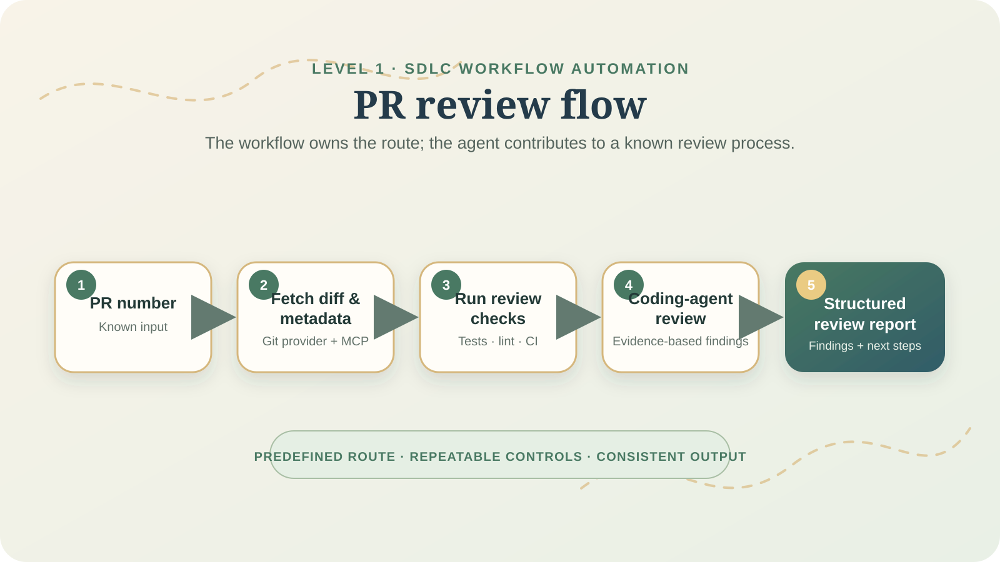
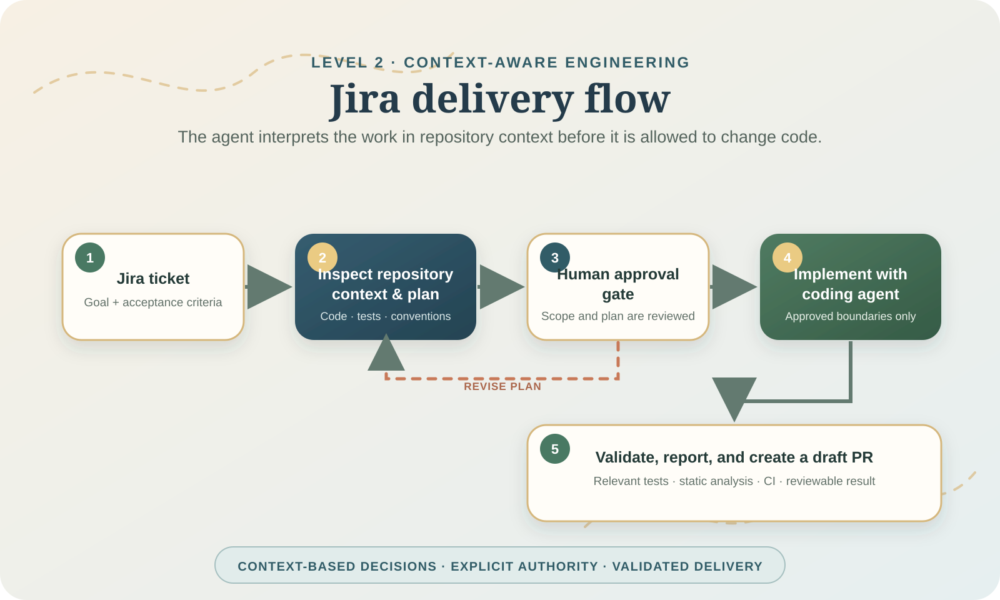

# From Tickets to Trusted Delivery: A Practical Map of AI-Assisted SDLC Workflows

*Draft for Medium*

Software delivery has always been a workflow: a problem is reported, someone clarifies it, code changes, tests run, reviewers inspect the change, and a release reaches an environment. AI can assist each step, but the phrase “AI-powered SDLC” hides important differences in capability and risk.

This article maps three practical maturity levels:

1. **SDLC workflow automation** — reliably execute known engineering steps.
2. **Context-aware engineering** — use repository and work-item context to decide how work should proceed.
3. **Autonomous engineering** — safely complete bounded engineering work with minimal intervention and clear escalation boundaries.

They are not competing labels for the same product. They are layers of responsibility, and a mature system usually combines them.

## First: what makes up an AI-assisted SDLC workflow?

An SDLC workflow is the sequence of decisions and controls that turns an engineering request into a trustworthy delivery. An AI-enabled version still needs the familiar engineering systems:

- **Work management** — Jira or another tracker provides the request, acceptance criteria, ownership, and history.
- **Source control and delivery controls** — GitHub, GitLab, or Bitbucket provides branches, pull requests, reviews, CI checks, and merge controls.
- **Coding agents** — Codex, GitHub Copilot CLI, Claude Code, or comparable agents inspect and modify the repository.
- **MCP integrations** — Model Context Protocol servers give agents bounded access to systems such as Jira, GitHub, local tools, and documentation.
- **Workflow/orchestration engine** — coordinates stages, state, retries, approval gates, and results.
- **Validation and policy** — unit tests, linters, security checks, CI, and human approval decide whether output is trustworthy.

The agent is not the workflow. It is one participant inside a system that should preserve traceability and stop safely when confidence or authority is insufficient.

## The three maturity levels

### 1. SDLC workflow automation: the route is known

In workflow automation, the process determines the next step. The workflow may call an AI agent, but its route is predefined.

```text
PR number
  → fetch diff
  → inspect changed files
  → run selected checks
  → ask a coding agent for review findings
  → publish a review report
```

This is valuable because it standardizes repeatable work: fewer missed checks, a consistent report, and clear run history. It does **not** require the system to invent a delivery strategy.

Our PR review flow belongs here. It accepts a pull-request number and follows an expected engineering-review sequence. It can be intelligent at individual steps, but the workflow owns the route.

### 2. Context-aware engineering: the system interprets before it acts

Context-aware engineering begins with a goal rather than a fully specified route. The system has to interpret the work item in the context of the repository and make bounded decisions.

```text
Jira ticket + repository
  → inspect relevant code, tests, and conventions
  → identify likely affected components
  → form an implementation plan
  → request human approval
  → implement and validate the approved plan
```

This is why the Jira delivery flow is more than automation. The ticket does not necessarily identify the files to modify, the relevant architectural boundary, or the validation strategy. The agent must reason over the codebase and explain its plan before it receives authority to change code.

Context-aware engineering is still governed engineering. A human approval gate, limited tool permissions, and validation are intentional design choices—not signs that the system has failed to automate.

### 3. Autonomous engineering: bounded outcomes, not unlimited authority

Autonomous engineering adds the ability to complete a carefully scoped outcome end to end. For example:

> Investigate this reproducible failing test, make the smallest safe fix, validate it, and open a draft pull request. Escalate if the change affects authentication, data migration, public API contracts, or required checks.

This is not “an agent that can change anything.” It is constrained autonomy with explicit stop conditions, isolated credentials, tests, policy checks, observability, and a way to recover or revert.

Autonomy is earned through reliable performance at levels 1 and 2. Without repeatable validation and review, autonomous execution simply automates risk.

## Our two workflow examples

The same orchestration platform can support both level 1 and level 2. The difference is the decision-making scope, not the tool name.





The PR review flow is a high-value example of level 1: it automates a known path. The Jira delivery flow contains level-1 delivery steps, but its analysis and planning stage are level 2 because they adapt to ticket and repository context.

## Where LangGraph, Stepwise, and Dagu fit

These tools overlap in workflow orchestration, but they emphasize different problems.

| Tool | Natural role | Strongest fit |
|---|---|---|
| **LangGraph** | Stateful, code-first agent orchestration | Context-aware decisions, conditional routing, custom state, approval interrupts |
| **Stepwise** | Agent and human workflow harness | Observable DAG runs, shared agent sessions, approval gates, auditability |
| **Dagu** | Local-first operational workflow runner | YAML-defined scripts, scheduling, retries, CI polling, repeatable execution |

### LangGraph: reasoning inside the workflow

LangGraph is useful for both deterministic and adaptive flows. We use it to express stages, state, approvals, and agent adapters in Python. It is particularly helpful when the workflow needs to decide what information to inspect or how to respond to validation results.

### Stepwise: governed agent work

Stepwise is compelling when the main need is visible, resumable, approval-driven agent work. Its YAML flows and live DAG view can reduce the amount of operational UI a team needs to build. It is closest to LangGraph when coordinating agent steps, but it brings a more declarative and run-governance-first model.

### Dagu: reliable rails around known work

Dagu is best understood as reliable execution around existing scripts and tools. It can launch coding-agent CLIs, tests, GitHub commands, scheduled checks, and CI polling from a local YAML DAG. It does not replace contextual reasoning; it can provide durable rails around it.

```text
Dagu schedules or reliably starts a delivery run
  → LangGraph interprets a ticket and coordinates context-aware work
  → coding agent implements within approved boundaries
  → CI, policy checks, and human review determine delivery
```

## A practical implementation strategy

Do not introduce every orchestration tool at once.

1. **Start with a small, observable workflow.** Build a PR review flow or ticket-analysis flow with clear inputs and useful output.
2. **Add context deliberately.** Connect only the repository, work tracker, and tools needed for the task through scoped MCP integrations.
3. **Keep human gates at authority boundaries.** Planning approval, pull-request review, and production deployment should not silently become unrestricted agent actions.
4. **Make validation non-negotiable.** Record tests, static analysis, CI state, and agent reports with each run.
5. **Add operational durability when it is needed.** A local runner such as Dagu becomes compelling for schedules, retries, multi-repository execution, and long-running operational workflows.
6. **Grant autonomy by scope.** Expand from read-only analysis, to draft PRs, to narrowly defined fixes only when the earlier levels are reliable and measurable.

## Closing thought

The interesting question is not whether an SDLC workflow uses AI. It is whether the system knows what it is allowed to decide, what it must prove, and when it must ask a person.

Workflow automation creates dependable rails. Context-aware engineering helps agents choose the right route. Autonomous engineering is the disciplined combination of both—bounded by policy, validation, and human accountability.
